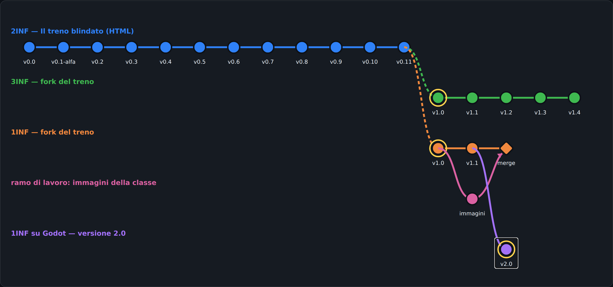

# La storia del nostro gioco: versioni, rami e il grafo di Git

**Versione 1.0** — 09/10/2026 · Classi 1INF e 2INF · Laboratorio

Testo per la tua AI: chiedile di spiegarti ogni parte nella tua lingua.

## 01 Che cosa facciamo oggi

1. Carta e penna sul banco: oggi si disegna il grafo a mano.
   1.1 العربية: ضع الورقة والقلم على الطاولة: اليوم نرسم الرسم البياني باليد.
   1.2 中文：桌上放好纸和笔：今天我们用手画版本图。
2. VINCI SUBITO (5 minuti). Apri il grafo, clicca il primo pallino BLU (v0.0) e premi il bottone verde «Apri questa versione»: gioca 30 secondi. Poi torna al grafo, clicca il pallino VIOLA (v2.0) e gioca ancora. Sul foglio scrivi 2 cose che sono cambiate.
   2.1 العربية: اربح فوراً: افتح الرسم البياني، اضغط أول دائرة زرقاء (v0.0) ثم الزر الأخضر، والعب 30 ثانية. ثم اضغط الدائرة البنفسجية (v2.0) والعب. اكتب على الورقة شيئين تغيّرا.
   2.2 中文：马上赢：打开版本图，点第一个蓝色圆点（v0.0），按绿色按钮，玩30秒。再点紫色圆点（v2.0）再玩。在纸上写两样改变了的东西。
3. Leggi le 8 parole del grafo (tabella qui sotto) e copiale sul foglio con la traduzione nella tua lingua.
   3.1 العربية: اقرأ الكلمات الثماني (الجدول أدناه) وانسخها على الورقة مع الترجمة بلغتك.
   3.2 中文：读下面表格里的8个词，把它们和你的语言的翻译一起抄在纸上。
4. Clicca i pallini del TUO ramo (arancione per la 1INF, blu per la 2INF): leggi «Cosa è cambiato e perché». Trova la versione dove c'è una cosa fatta dalla tua classe.
   4.1 العربية: اضغط دوائر فرعك (برتقالي لـ 1INF، أزرق لـ 2INF) واقرأ ماذا تغيّر ولماذا. ابحث عن النسخة التي فيها شيء صنعه صفك.
   4.2 中文：点你们分支的圆点（1INF 是橙色，2INF 是蓝色），读「改变了什么，为什么」。找到有你们班做的东西的版本。
5. SCHEMA A MANO: disegna sul foglio un grafo con 3 colori: il ramo principale, un fork e un ramo di lavoro che rientra con un merge. Sotto ogni pallino scrivi il numero di versione.
   5.1 العربية: ارسم باليد رسماً بثلاثة ألوان: الفرع الرئيسي، نسخة fork، وفرع عمل يعود بـ merge. اكتب رقم النسخة تحت كل دائرة.
   5.2 中文：手画图：用三种颜色画：主分支、一个 fork、一个用 merge 合并回来的工作分支。在每个圆点下写版本号。
6. PROVA DEL NOVE: spiega a voce al compagno, con parole tue, cos'è un merge e perché la versione Godot si chiama 2.0 e non 1.2.
   6.1 العربية: اشرح لزميلك بكلماتك: ما هو merge، ولماذا نسخة Godot اسمها 2.0 وليس 1.2.
   6.2 中文：用你自己的话给同学讲：什么是 merge，为什么 Godot 版本叫 2.0 而不是 1.2。

Indirizzo del grafo (scrivilo esattamente così):

```
https://nicolaregge-pulse.github.io/corso-informatica/giochi/grafo/
```



## 02 Le 8 parole del grafo

| Italiano | العربية | 中文 | Nel nostro gioco |
|---|---|---|---|
| versione (commit) | نسخة (حفظ commit) | 版本（提交 commit） | Ogni pallino del grafo: v0.3, v1.1, v2.0… |
| ramo (branch) | فرع (branch) | 分支（branch） | Una linea del grafo: il gioco cresce lungo il ramo. |
| fork (copia) | نسخة مستقلة (fork) | 复刻（fork，复制） | La 1INF copia il gioco della 2INF e lo fa crescere per conto suo. |
| Pull Request (proposta di modifica) | اقتراح تعديل (Pull Request) | 修改建议（Pull Request） | Il vostro Documento su Classroom: «il mio cattivo si chiama…». |
| merge (unione) | دمج (merge) | 合并（merge） | Il ramo «immagini» rientra nel ramo della 1INF. |
| versione minor (1.1, 1.2…) | إصدار صغير (1.1، 1.2…) | 小版本（1.1、1.2……） | Piccole aggiunte: un cattivo nuovo, un cielo nuovo. |
| versione major (2.0) | إصدار كبير (2.0) | 大版本（2.0） | Cambia una cosa grossa: il motore diventa Godot. |
| release (versione pubblicata) | إصدار منشور (release) | 发布（release） | La versione che tutti possono giocare con un link. |

## 03 Perché

1. **Perché i numeri cambiano così.** v0.x = le prove, prima della versione stabile (la 2INF ha fatto 12 prove: v0.0 → v0.11). 1.0 = la prima versione «vera» di un ramo (il fork della 1INF e della 3INF). 1.1, 1.2 = versioni MINOR: piccole aggiunte (un cattivo, un cielo). 2.0 = versione MAJOR: cambia una cosa grossa (il motore Godot), il primo numero sale e il secondo riparte da 0.
   1.1 العربية: v0.x = تجارب. 1.0 = أول نسخة حقيقية. 1.1، 1.2 = إضافات صغيرة (minor). 2.0 = تغيير كبير (major): الرقم الأول يزيد والثاني يعود إلى 0.
   1.2 中文：v0.x = 试验。1.0 = 第一个真正的版本。1.1、1.2 = 小的增加（minor）。2.0 = 大的改变（major）：第一个数字加一，第二个数字回到 0。
2. **Perché si fanno i rami.** Per provare una cosa nuova SENZA rompere il gioco che funziona. Il prof ha fatto la funzione «immagini della classe» su un ramo a parte; quando funzionava l'ha unita (merge) al ramo della 1INF. Nelle aziende si lavora sempre così: ognuno sul suo ramo, poi Pull Request, controllo e merge.
   2.1 العربية: لنجرّب شيئاً جديداً دون أن نكسر اللعبة التي تعمل. في الشركات يعمل كل واحد على فرعه، ثم Pull Request، ثم مراجعة، ثم merge.
   2.2 中文：为了试新东西而不弄坏能玩的游戏。在公司里大家都这样工作：每人在自己的分支上，然后 Pull Request、检查、合并（merge）。
3. **Perché Godot (v2.0).** Godot è un motore vero per videogiochi, gratis e portabile (non si installa), usato anche nel lavoro. I vostri cattivi ci sono ancora: stanno nei file di dati (cattivi.json), uguali a prima. Ponte da Lazarus: Lazarus REAGISCE (aspetta un clic), Godot PULSA (_process gira da solo circa 60 volte al secondo).
   3.1 العربية: Godot محرك حقيقي للألعاب، مجاني ولا يحتاج تثبيت. أشراركم ما زالوا موجودين في ملف البيانات cattivi.json. Lazarus ينتظر النقرة، Godot ينبض 60 مرة في الثانية.
   3.2 中文：Godot 是真正的游戏引擎，免费、不用安装。你们的坏人还在数据文件 cattivi.json 里。Lazarus 等待点击，Godot 每秒跳动约60次。

## 04 La storia, ramo per ramo

1. **2INF — Il treno blindato (HTML), il ramo principale** — العربية: ١٢ نسخة من v0.0 إلى v0.11: من الفكرة الأولى إلى اللعبة الكاملة. · 中文：从 v0.0 到 v0.11 共12个版本：从第一个想法到完整的游戏。
   1.1 **v0.0 — Prima idea: il finestrino laterale.** Il treno visto dal finestrino di lato: paesaggio che scorre, cattivi che sbucano da dietro alberi e case, vetro da 5 colpi. Poi la classe ha disegnato alla lavagna la vista dalla cabina.
   1.2 **v0.1-alfa — Demo del prof sul progetto della lavagna.** Vista dalla cabina lungo i binari (progetto della classe), cattivi da finestre, alberi e barili, facce della classe e copertina disegnata con l'IA, tachimetro, installabile come app. Da qui la classe corregge il tiro.
   1.3 **v0.2 — I personaggi della squadra PERSONAGGI.** Quattro personaggi disegnati con l'IA (tre agenti e il Boss dei cattivi), bottone «I personaggi», le loro facce nel gioco. Prima modifica arrivata dalla classe.
   1.4 **v0.3 — Più lento: richiesta della squadra TEST QUALITÀ.** Prima richiesta di modifica consegnata su Classroom dalla Triade: «il gioco va troppo veloce». Velocità del treno da 1 a 0,7.
   1.5 **v0.4 — Audit degli investitori: personaggi nascosti che escono.** Il cattivo è un personaggio intero nascosto dietro gli oggetti che esce di lato, più grande; treno al minimo (0,5); tolte 2 foto senza faccia.
   1.6 **v0.5 — Le regole della squadra MOTORE FISICA (Pull Request #104).** Prima Pull Request vera (#104) del capo MOTORE FISICA: cattivi sparano dopo 3 secondi, 100 punti per cattivo, velocità 0,5. Corretto 0,5 → 0.5 (in JSON i decimali vogliono il punto).
   1.7 **v0.6 — Il bosco bruciato della squadra SCENARI.** Richiesta SCENARI: cielo rosso cupo, alberi bruciati e rottami fumanti vicino ai binari. Richiesta PERSONAGGI: il cattivo dice «Hahahahaha, perdente!» quando spara.
   1.8 **v0.7 — Omini interi che escono dal nascondiglio.** Indicazione del prof: omini interi (testa, busto, braccia, gambe, arma) al posto dei cerchietti; si alzano da dietro il nascondiglio ed escono di lato con un «!»; quando li colpisci cadono.
   1.9 **v0.8 — Mimetica, facce senza cerchio e il fucile d'assalto.** Indicazioni del prof: facce senza cerchio (solo la faccia), barretta del tempo sopra la testa, omini in mimetica, l'Agente Speciale con il fucile d'assalto.
   1.10 **v0.9 — Teste in proporzione.** Indicazione del prof: la testa degli omini lontani era troppo grossa (misura minima fissa); ora è sempre in proporzione al corpo.
   1.11 **v0.10 — I migliori punteggi.** Indicazione del prof: classifica dei primi 10 con soprannome a fine partita, mostrata nella schermata iniziale; record della classe da record-classe.json.
   1.12 **v0.11 — I punteggi si salvano sempre.** Difetto segnalato dal prof: il punteggio ora si salva da solo a fine partita, il soprannome si conferma anche con Invio; il gioco chiede sempre alla rete la versione nuova.
2. **3INF — fork (copia) del gioco della 2INF** — العربية: صف 3INF نسخ لعبة 2INF (fork) وأضاف أشراراً ومناظر جديدة. · 中文：3INF 班复制（fork）了 2INF 的游戏，并加入了新的坏人和风景。
   2.1 **v1.0 — Il fork della 3INF: traversine di legno e nuvole.** La 3INF fa la sua copia (fork) del gioco della 2INF (v0.11). Traversine di legno con venature e nodi, nuvole nel cielo.
   2.2 **v1.1 — Black Panter (PR #1 e #2, SCENARI).** Pull Request #1 (PC 18) e #2 (PC 17) dalla consegna su Classroom: il cattivo Black Panter con la mimetica nera e argento, esce da una porta, dice «Yahuu!».
   2.3 **v1.2 — Montagna, tempo che peggiora, Travor.** PR #4 Dani e #5 Ale (SCENARI): si parte dalla montagna, cielo sereno, il tempo peggiora a ogni livello. PR #6 Tomas (PERSONAGGI): il cattivo Travor, mimetica grigia.
   2.4 **v1.3 — Cespugli, greggi, armi diverse, nuovi cattivi.** PR #8 Mirko: cespugli e armi diverse; #13 Dani e #14 Ale: greggi in montagna; #10 Domi e #11 Tomas: Travor e il protagonista Nash; #12 Eric: Franciscos.
   2.5 **v1.4 — Treno più veloce, Nash, Dylan, cielo che cambia subito.** PR #17 Noah: velocità 2; #15 Domi: Nash; #19 Emmanuel: Dylan; #18 Eric: Franciscos azzurro e bianco; #20 Dani e #21 Ale: difetto del cielo sistemato.
3. **1INF — fork (copia) del gioco della 2INF** — العربية: صفكم 1INF نسخ اللعبة وأضاف أشراركم وألوان السماء. · 中文：你们 1INF 班复制了游戏，加入了你们的坏人和天空的颜色。
   3.1 **v1.0 — Il fork della 1INF.** Copia (fork) del gioco della 2INF alla versione v0.11. Da qui partono le Pull Request della 1INF.
   3.2 **v1.1 — I primi cattivi e i cieli della 1INF.** Pull Request accettate: cattivi Hidra (Giexther A.), EI (Yinlin L.), Mister Bar Berry (Matteo A.); cielo arancione in montagna (Giexther A.), cielo di guerra nel bosco (Yinlin L.), cielo viola in città (Wesley J.).
4. **Ramo di lavoro del prof: «immagini della classe» → merge nella 1INF** — العربية: الأستاذ جرّب ميزة جديدة في فرع منفصل، ثم دمجها (merge) في فرع 1INF. · 中文：老师在一个单独的分支上试了新功能，然后把它合并（merge）到 1INF 的分支。
   4.1 **immagini — Nuova funzione su un ramo separato.** Il prof prova una cosa nuova su un RAMO a parte, così il gioco che funziona non si rompe: cartelle per le immagini (cattivi, paesaggi, difetti, revisioni), galleria con i nomi, foto prese da sole dalle consegne di Classroom. Quando funziona: MERGE (unione) nel ramo della 1INF.
5. **1INF su Godot — versione 2.0 (major)** — العربية: نفس اللعبة لكن بمحرك Godot: تغيير كبير، لذلك الرقم يصبح 2.0. · 中文：同一个游戏，但是用 Godot 引擎做的：大变化，所以版本号变成 2.0。
   5.1 **v2.0 — Il treno su Godot.** Stesso gioco della 1INF v1.1 (cattivi Hidra, EI, Mister Bar Berry e i cieli della 1INF), ma rifatto con il motore Godot 4.7 ed esportato per il browser. È cambiato il motore, cioè una cosa grossa: per questo il numero passa da 1.x a 2.0 (versione major).

## 05 Changelog

1. v1.0 (09/10/2026) — prima versione della lezione.
